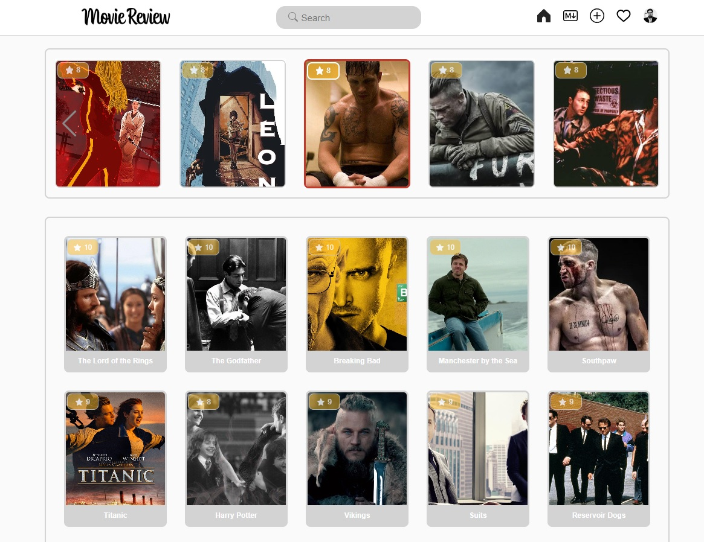
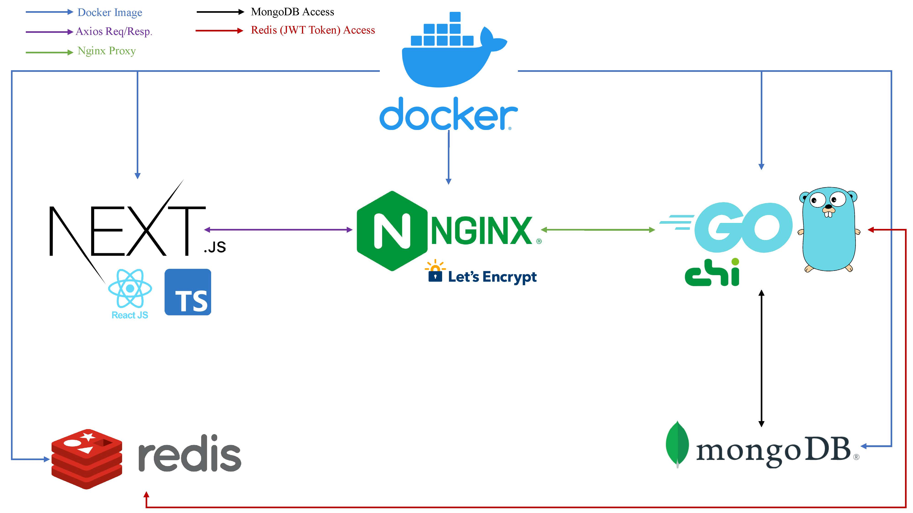
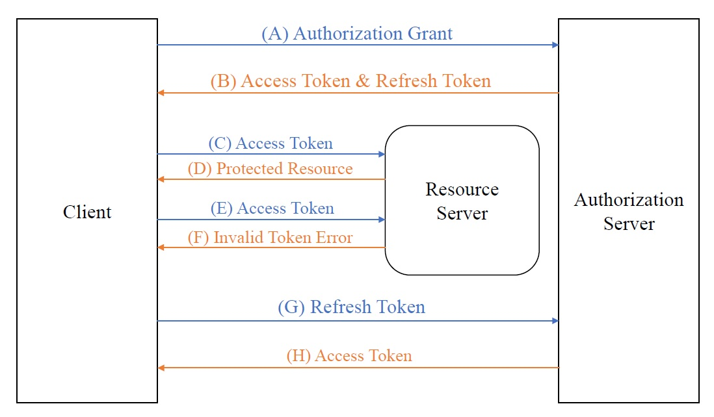

# Movie Review Website



## ABOUT

- Front-end: Nextjs with Typescript. Back-end: Go (chi). Proxy: Nginx with Letsencrypt certificate. NoSQL: MongoDB, Redis.

- **For more details, please see the photos folder.**

## HOW IT WORKS - Connections



- Nginx with Letsencrypt certificate handles the proxy connection for the back-end.

- MongoDB stores data while Redis stores the refresh tokens.

## SECURITY - Authorization



- The Access token will be stored in local storage on the front-end when Refresh tokens are stored in HTTP Cookies on the back-end.

- Reference: [OAuth 2.0 Authorization Framework](https://www.rfc-editor.org/rfc/rfc6749)

## Prerequisites

- [Docker](https://docs.docker.com/get-docker/)

## Setup

- **NOTE:** Before setup, don't forget to set configs in the backend/config/config.go

- Build containers and start services:

```bash
docker-compose up --build
```

- Detailed commands: [Docker Commands](https://docs.docker.com/engine/reference/commandline/docker/)

## Access Website

- Frontend: localhost:3000
- Backend: localhost:80
